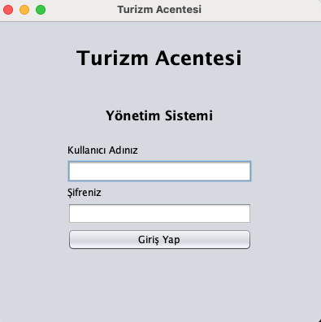
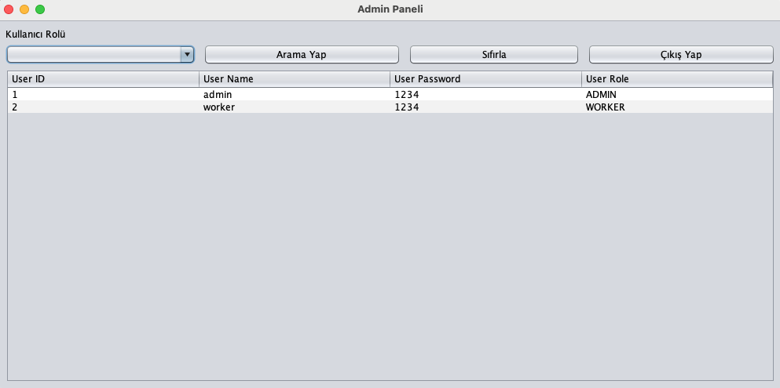
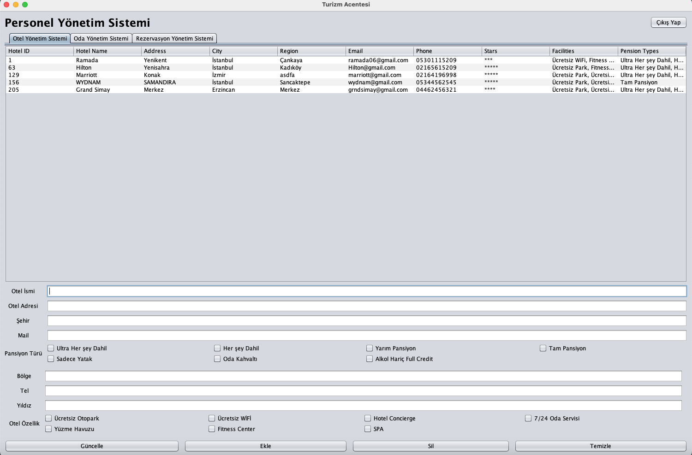
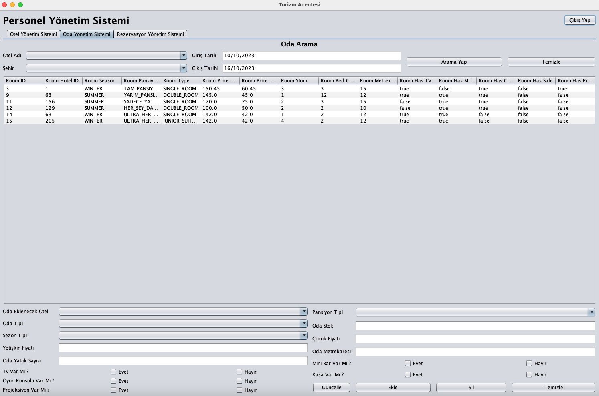
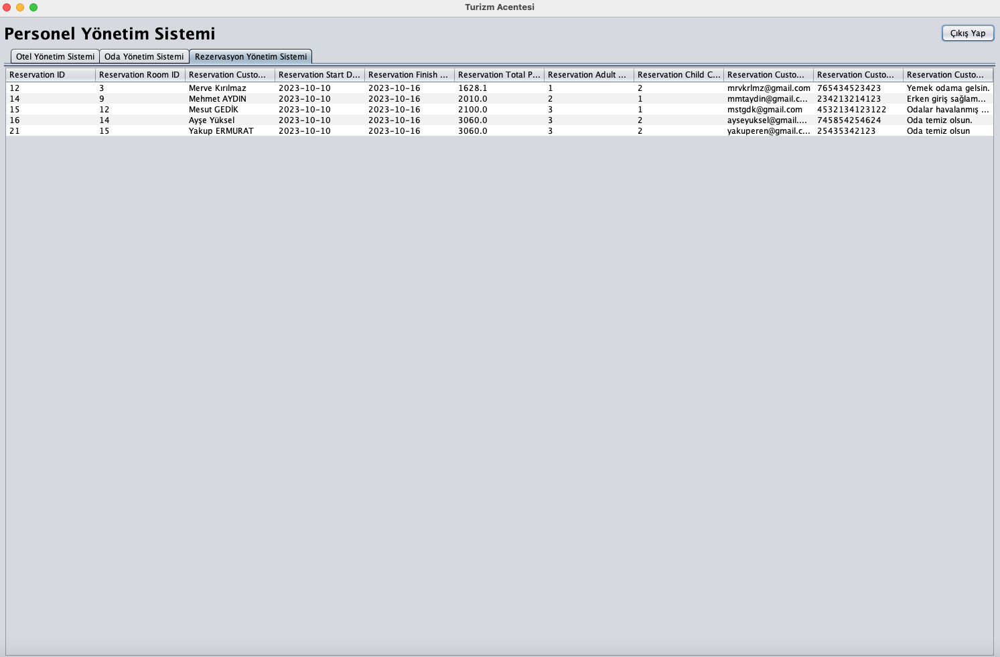
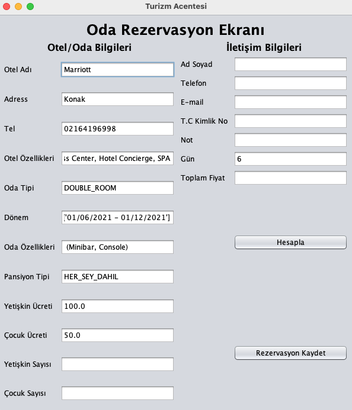

# Turizm Acente Yönetim Sistemi

Bu proje, turizm acenteleri için bir yönetim sistemidir. Kullanıcılar otel, oda ve rezervasyon yönetimi yapabilirler. Sistem, farklı kullanıcı rolleri (admin ve worker) için farklı yetenekler sağlar.

## Özellikler

- **Kullanıcı Yönetimi**: Kullanıcı ekleme, güncelleme, silme ve arama.
- **Otel Yönetimi**: Otel ekleme, güncelleme, silme ve arama.
- **Oda Yönetimi**: Oda ekleme, güncelleme, silme ve arama.
- **Rezervasyon Yönetimi**: Rezervasyon ekleme, güncelleme, silme ve arama.
- **Farklı Kullanıcı Rolleri**: Admin ve Worker rolleri için ayrı yönetim panelleri.

## Kullanılan Teknolojiler

- Java
- Swing GUI
- PostgreSQL

## Kurulum

1. **Projeyi Klonlayın**:
    ```bash
    git clone https://github.com/kullaniciAdi/tourismAgency.git
    cd tourismAgency
    ```

2. **Veritabanını Ayarlayın**:
    - PostgreSQL'i kurun ve çalıştırın.
    - `src/core/Db.java` dosyasındaki veritabanı bağlantı bilgilerini kendi PostgreSQL ayarlarınıza göre güncelleyin.
    - GitHub deposunda bulunan `tourismAgency.sql` dosyasını kullanarak veritabanınızı oluşturun ve aşağıdaki komutlarla geri yükleyin:
      ```bash
      psql -U postgres -f tourismAgency.sql
      ```

3. **Projeyi Derleyin ve Çalıştırın**:
    - Projeyi bir Java IDE'sinde (IntelliJ IDEA gibi) açın.
    - Gerekli bağımlılıkları (PostgreSQL JDBC Driver gibi) ekleyin.
    - `App.java` dosyasını çalıştırın.

## Katmanlı Mimari

Proje, katmanlı mimari kullanılarak geliştirilmiştir ve aşağıdaki paketlere ayrılmıştır:

- **entity**: Veritabanı tablolarına karşılık gelen varlık sınıflarını içerir.
- **business**: İş mantığı ve servis katmanını içerir.
- **dao**: Veritabanı erişim nesnelerini (Data Access Objects) içerir.
- **view**: Kullanıcı arayüzü bileşenlerini içerir.
- **core**: Yardımcı sınıflar ve genel yapılandırmaları içerir.

## Uygulama Ekranları ve Açıklamaları

### Giriş Ekranı
Kullanıcıların sisteme giriş yapmasını sağlayan ekrandır.



### Admin Paneli
Admin kullanıcılarının sistemdeki kullanıcıları yönetebileceği ekrandır.



### Otel Yönetim Paneli
Admin ve employee kullanıcılarının otel bilgilerini yönetebileceği ekrandır.



### Oda Yönetim Paneli
Admin ve employee kullanıcılarının oda bilgilerini yönetebileceği ekrandır.



### Rezervasyon Yönetim Paneli
Admin ve employee kullanıcılarının rezervasyon bilgilerini yönetebileceği ekrandır.



### Oda Rezervasyon Ekranı
Müşteriler için oda rezervasyonu yapılmasını sağlayan ekrandır.



